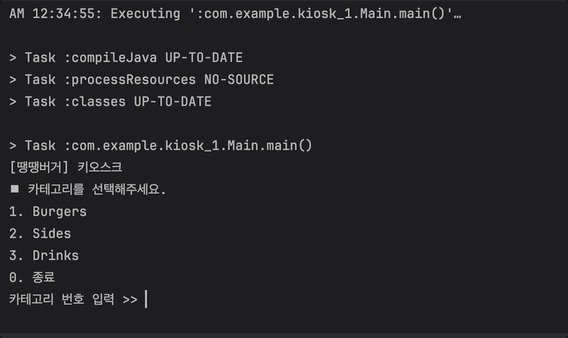
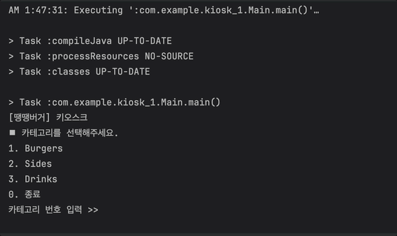

# [Spring 5기] CH 2 키오스크 과제

---

## 개발환경

- OS : Mac
- IDE : IntelliJ IDEA 2024.3.1.1
- JDK : `17` Amazon Corretto 17.0.13
- Version control : `Git`
- Issue Tracking : `Github`
- 개발자 : Spring 5기 김혜민

## Lv1-5. [필수] 키오스크 필수기능구현 

- User Interface : Console
- 코드구현에 주로 사용한 관점 : Object-oriented programming
- 왜 이렇게 코딩해야하는지를 생각하며 코딩하기
- 요구사항/구상 : [[Issues문서 링크]](https://github.com/learner-nosilv/Sparta_2st_Kiosk/issues/1)
- 세부설계/달성도 : [[Issues문서 링크]](https://github.com/learner-nosilv/Sparta_2st_Kiosk/issues/2)
- 구현일 : 2025-01-14(화) ~ 2025-01-23(목)
- 개발 복기 : [[문서 링크]]()

### 코드 구조
```java
📦kiosk_1
├─ Main.java
├─ MenuItem.java
├─ Menu.java
└─ Kiosk.java
```
### 클래스 소개
- **MenuItem class**
  - 해당 클래스 객체의 의미 → 음식 하나 ∋ { 이름, 가격, 설명 }
  - **Attribute**
      - 음식명 : `private` String itemName
      - 음식가격 : `private` double itemPrice
      - 음식설명 : `private` String itemDescription
  - **Method**
    - 기본적인 getter, setter 함수들
    - toString overriding
      - `return (String.format("%-22s | W %.1f | %s", itemName, itemPrice,itemDescription));`
- **Menu class**
    - 해당 클래스 객체의 의미 → 한 카테고리 속 모든 음식 ∋ { 카테고리 이름 , 음식 리스트}
    - **Attribute**
        - 카테고리명 : `private` String category
        - 음식리스트 : `private` List<MenuItem> categoryItems
    - **Method**
        - 기본적인 getter, setter 함수들
        - toString() overriding
```
          public String toString() {
            String returnStr = "[ "+category + " ]\n";
            int i=1;
            for(MenuItem item : this.categoryItems)
              returnStr += ((i++) +". "+item.toString() + "\n");
            return returnStr;
          }
```
- **Kiosk class**
  - 모든 카테고리의 음식들을 다루며ㅡ 손님-기계내부 사이의 인터페이스를 갖춘 기계
  - 손님에게 카테고리별 음식들을 보여주고 사용자 입력을 받아서 입력에 따른 개별 로직을 진행하는 하나의 기계
  - **Attribute**
    - 특정 카테고리의 음식 묶음(리스트)의 리스트 : `private` `List<Menu> totalMenus`
  - **Method**
    - `public` start() : 키오스크를 구동하는 메소드
      - ① 모든 메뉴 카테고리 출력하기
      - ② 카테고리에 대한 사용자 입력받기
      - ③ 입력값 유효성 검사
      - ④ 사용자가 입력한 번호에 따라 특정 카테고리 내 모든 음식 소개 출력하기
      - ⑤ 음식에 대한 사용자 입력받기
      - ⑥ 입력값 유효성 검사
      - ⑦ 사용자 선택 번호에 따라 다른 로직 실행
      - 사용자 입력이 `0` 이면 키오스크 종료
- **`main` Main class**
  - 시작 지점이 되는 클래스, `public static void main(String[] args)`


### 작동 과정
- **Main 클래스의 main 메소드**가 
  - 음식 객체(Menuitem)를 여러개 생성하고
  - 위의 음식 객체들을 포함하는 하나의 카테고리 객체(Menu)를 여러개 생성하고
  - 키오스크 객체 하나 생성 (위의 카테고리 객체들을 리스트화하여 키오스크 생성자로 넘김
  - 키오스크 구동 `start()`
- **Kiosk 객체.start() 진행**
  - ① 모든 메뉴 카테고리를 출력함
  - ② 카테고리에 대한 사용자 입력을 받음
  - ③ 입력값 유효성 검사
    - 유효하지 않은 값이 입력될 시 안내 문구 출력 후 ② 사용자 입력받는 단계로 되돌아감
    - 유효값 입력시 다음 단계 ④ 진행
  - ④ 사용자가 입력한 번호에 따라 특정 카테고리 내 모든 음식 소개 출력하기
    - 사용자 입력이 `0` 이면 키오스크 종료
  - ⑤ 음식에 대한 사용자 입력받기
  - ⑥ 입력값 유효성 검사 (검사와 처리방식 ③과 동일)
  - ⑦ 사용자 선택 번호에 따라 다른 로직 실행
    - 사용자 입력이 `0` 이면 키오스크 종료
- 키오스크 종료로 되돌아온 Main 클래스의 main메소드 종료 = 프로그램 종료

### 작동 예시
- **Normal** 정상적인 입력(0 ~ 범위 내 정수)에서의 작동예시
  
- **Exception** 범위 밖의 정수를 입력한 경우의 작동예시
  
- **Exception** 소수, 문자, 문자열을 입력한 경우의 작동예시
- 